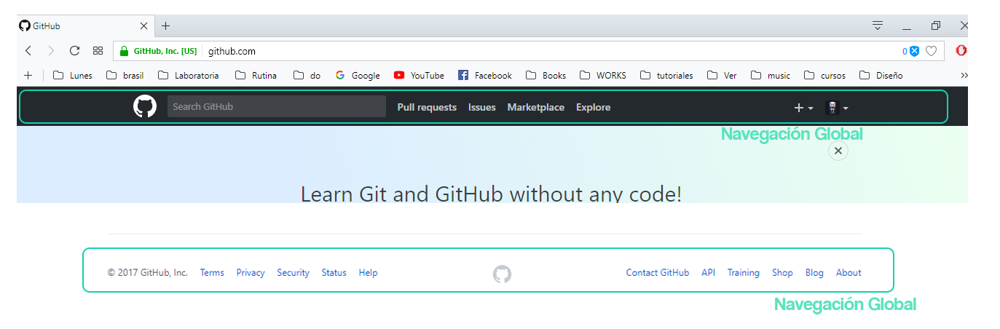
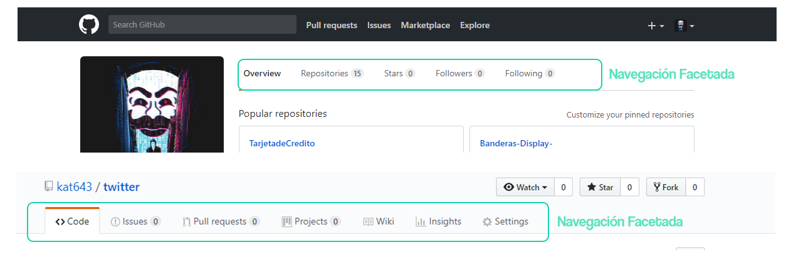
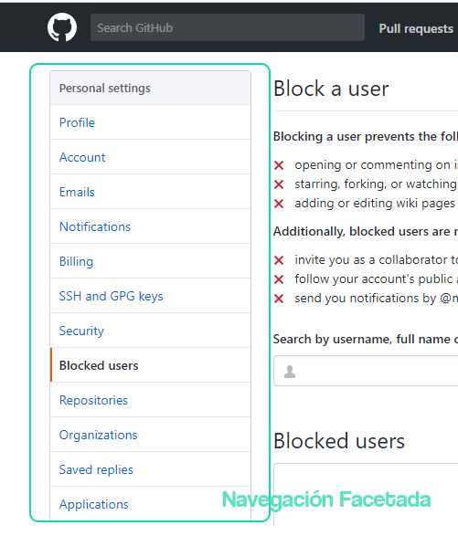
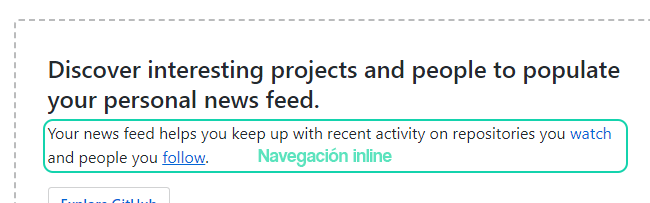
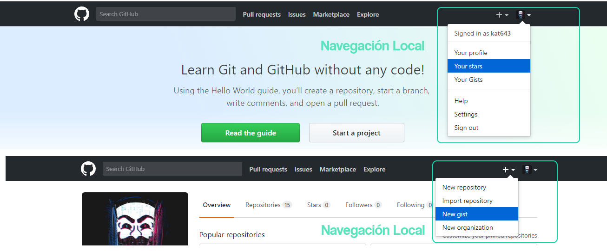
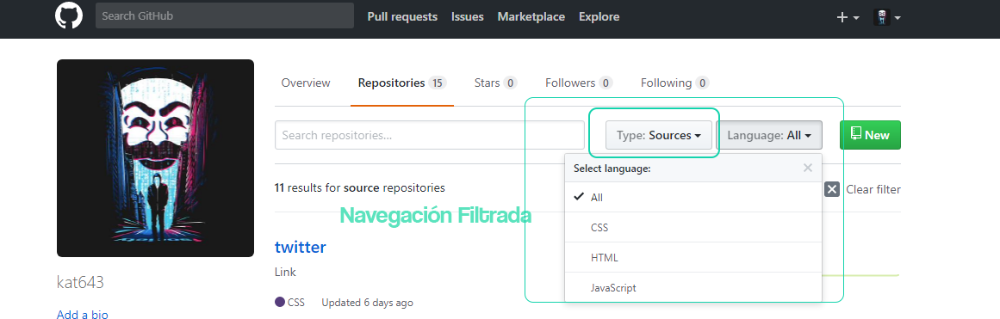
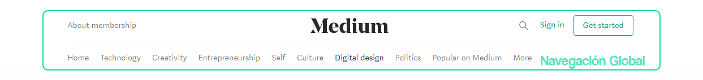
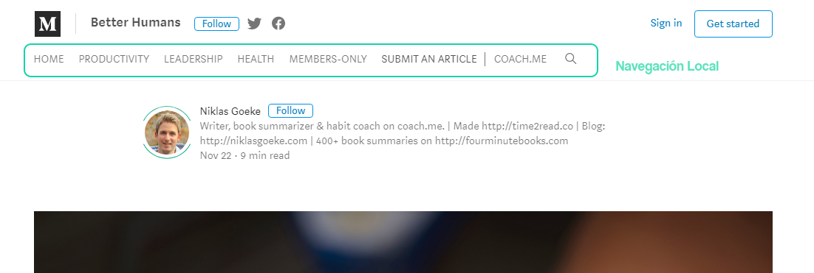
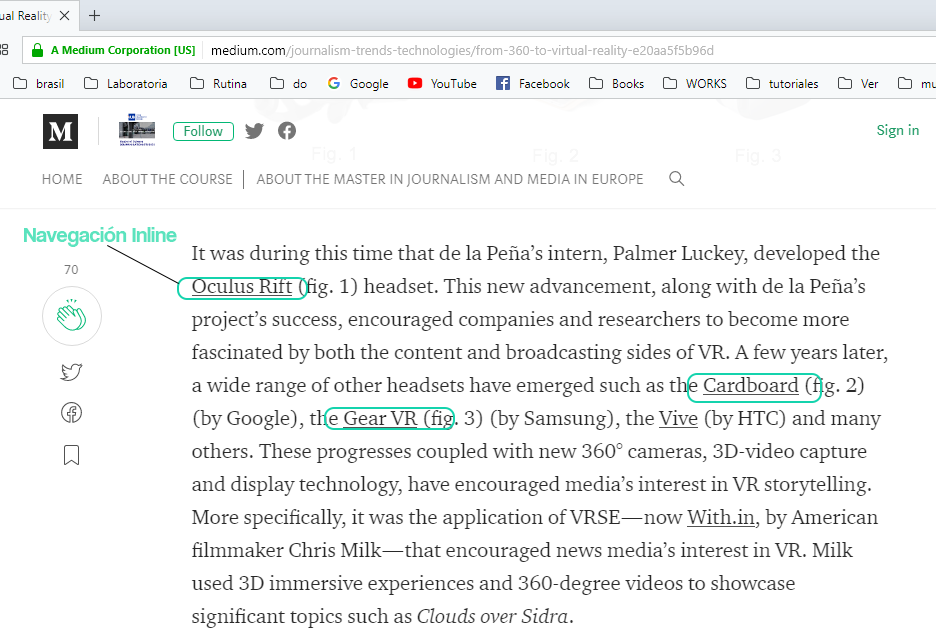
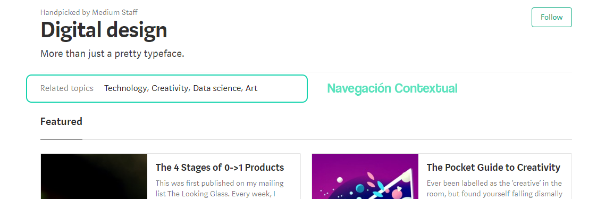

# Reto 2 ux

#### 2. Identifica los elementos de navegación en los siguientes sites

* [Breather](https://breather.com)
* [Github](https://github.com)
* [Medium](Medium)
___
#### Breather:
![Imagen 1][1]  ![Imagen 2][2] ![Imagen 3][3] ![Imagen 4][4] ![Imagen 5][5]

[1]: img/Breather/Navglobal.png
[2]: img/Breather/Navfacetada.png
[3]: img/Breather/Navfacetada2.png
[4]: img/Breather/NavinLine.png
[5]: img/Breather/NavFiltrada.png

#### Github:

#### Medium:

___
## Contenido

Este proyecto contiene:

1. Un archivo  **`README.md`** que explica el contenido del repositorio.

2. Una carpeta `img` donde se encuentran 3 carpetas (Breather,Github, Medium)las cuales contienen de forma ordenada las imagenes usadas en el trabajo en formato **png**.

## Autora
Kattia Rojas Arohuanca.

## Fecha
26/11/2017
